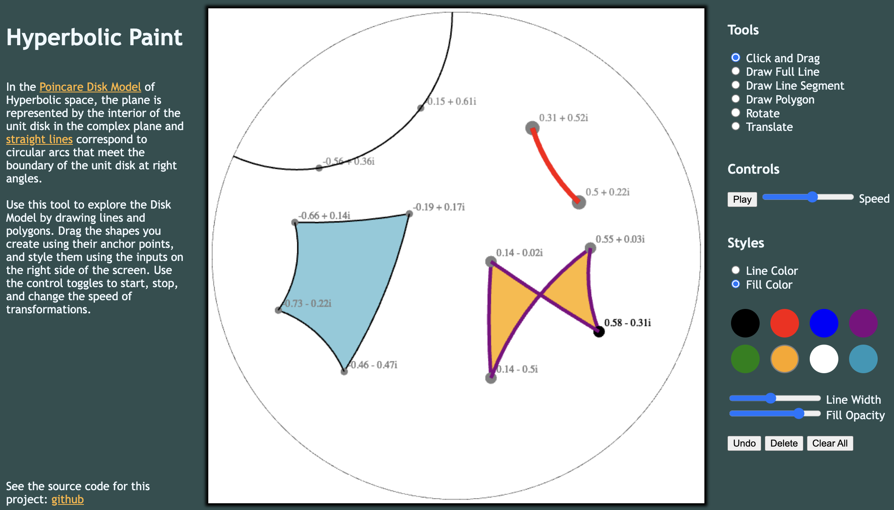

# Hyperbolic-Paint

## About:

Back in graduate school I studied hyperbolic geometry. I drew lots of (bad) pictures in many notebooks and always wished I could generate the pictures I saw in my head. [This project](https://nathancarllopez.github.io/Hyperbolic-Paint/) is my fulfillment of that wish.

## Demos:

Users can...

- Draw lines, line segments, and polygons, all with different styles.

- Drag drawings to change their shape.

- Rotate and translate drawings, as well as drag the center of rotation or axis of translation mid-animation.

## Next Steps:

In the short term, I'm working on adding a free drawing tool, and you can see my progress in the freeDraw branch. Currently, I can draw to the canvas and animate drawings I make, but dragging free drawings is turning out to be complicated. Additionally, I'd like to make all of this mobile friendly.

In the long term, I'd like this to be part of a larger project that allows a user to draw on all kinds of surfaces. Since the [universal cover](https://mathworld.wolfram.com/UniversalCover.html) of lots of surfaces is the hyperbolic plane, one can develop curves drawn on a surface to the hyperbolic plane by choosing a [fundamental domain](https://en.wikipedia.org/wiki/Fundamental_domain). My goal would be to have two canvases side-by-side, one showing the hyperbolic plane and the other a three dimensional version of the surface to draw on, and the user would be able to draw on either canvas and see the resulting curve appear on the other.

## Acknowledgements: 

- This youtube tutorial gave me a lot of help when building the design and function of the toolbars:
https://www.youtube.com/watch?v=wCwKkT1P7vY

- I used W3 schools tooltips page for the toolbar as well: https://www.w3schools.com/howto/howto_css_tooltip.asp